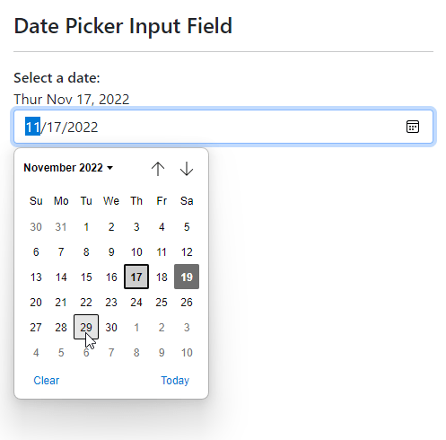
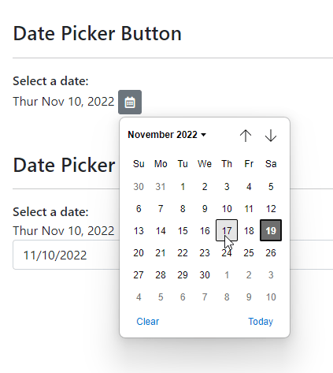

# DatePicker Native Helper Date Button
This repo holds a couple of HTML date helpers to make it easier to bind and unbind date values to `<input type='date' />` controls. It also includes an example on how to pop up a date button. 

* Assign dates directly to any `<input type="date" />`
* Fixes up date values to correctly display date timezones
* Allows options for easy limiting min/max date inputs
* Button only date popups (ie. no input box)
* **date-picker-button** Vue Component

Why this library? The way the date input control works sucks, as dates have to be formatted as a string in `ISO8601` format without a time compoent:

```html
<input type="date" 
       value="2022-11-29" 
       min="2022-10-30" max="2022-12-05"/>
```

This process is further complicated by the fact that the date has to be a UTC date (no time zone), while time values like `new Date()` tend to be local time values which have a time zone applied. In order to reliably bind a date, the time component has to be adjusted to reflect the time zone offset. This small library adjusts the date and spits out the correct format for binding both for the `value` and `min`/`max` values.

Additionally there's a Vue component that provides a button based date picker that uses a button without the input control. An HTML/CSS example how to create button date picker behavior is also provided below.

## Basic JavaScript Usage
This component works as a very simple control binder. You call a function and pass in an element, date and callback for notification when the date value is changed.

### Loading the library
There are two versions:

* Using ESM Module - datepicker-native.esm.js
* Global declares - datepicker-native.js

#### Using ESM Module
You can use ES 2015+ syntax to load via ESM module loading and then access `DatePickerNative`:

```html
 <script type="module">
   import  DatePickerNative from "./datepicker-native.esm.js";
       
   // parameters
   var dateControl = DatePickerNative(el, startDate, callBack);
   
   // or Options
   var dateControl2 = DatePickerNative({ 
       element: el,
       activeDate: startDate,
       callback: callback,
       min: 5, max: 5
   });
   ...
</script>   
```

#### Global Declarations
If you're not using ESM module you can use global access to the `DatePickerNative` instance by importing the script:

```html
<script src="datepicker-native.js"></script>
<script>
   // parameters
   var dateControl = DatePickerNative(el, startDate, callBack);
   
   // or Options
   var dateControl2 = DatePickerNative({ 
       element: el,
       activeDate: startDate,
       callback: callback,
       min: 5, max: 5
   });
   ...
</script>
```

### Usage
The idea with this component is that you can use JavaScript code to assign a date via code to an input element:

```js
var el = document.getElementById("StartDate");
var startDate = new Date();

// assign date and get notified on changes
var dateControl = DatePickerNative(el, startDate, 
   function(dt, event, instance) {
       // ... do something with changed `dt` value
   });
```

You can also use the *Options Syntax* instead:

```js
var elInput = document.getElementById("DatePickerInput");

// parameter syntax - Standard Date Input control
var dateControl = new DatePickerNative({ 
    element: elInput, 
    activeDate: startDate, 
    // + or - 5 days min date restriction
    // optional. date, or string date also work
    min: 5,             
    max: 5, 
    callback: function(dt, event, instance) {
        // do something with the update `dt` date
    } 
});
```

##  DatePicker Input and DatePicker Button
The native date picker control only works with a full input control that displays both the date input with a button to pop up the selection calendar which looks like this:



If you would rather display a just a button and pop up the calendar without displaying the input box you can use some custom CSS and HTML layout to accomplish a button only display like this:



The `date-picker-button.vue` component provides this button as a drop in component. If you're using plain HTML/CSS/JavaScript the following describes how to create a DatePicker button that effectively hides the input control.

## A DatePicker Button with plain HTML/CSS
A few steps are involved in creating a DatePicker Button:

* Add the button HTML
* Add `DatePickerNative.js` library
* Add `DatePickerNative.css` styles (small so you can inline these)

We'll start with the HTML which basically wraps a `<input type="date" />` control into an HTML button:

```html
<button id="DatePicker" class="datepicker-native btn btn-secondary btn-sm">
    <i class="far fa-calendar-alt"></i>
    <input type="date" class="datepicker-native-input" />
</button>
```

I'm using **font-awesome** for the icon here, but you can use whatever you like for the content for the button - text, image, icon, it doesn't matter. The `btn` styles are **bootstrap** but again, you can use whatever you want or no styling at all for the button.

The important, required pieces are the two styles:  

* **datepicker-native** on the button
* **datepicker-native-input** on the embedded `<input type="date" />` control

The trick to making the button work without the input control is to effectively making it invisible, but still active and overlaying the button content over it. The key to this is the CSS ([datepicker-native.css](datepicker-native.css)):

```css
.datepicker-native-button {
    position: relative;
}
.datepicker-native-button-input {
    position: absolute;
    overflow: hidden;
    width: 100%;
    height: 100%;
    right: 0;
    top: 0;
    opacity: 0;
}
.datepicker-native-button-input::-webkit-calendar-picker-indicator {
    position: absolute;
    right: 0;
    width: 100%;
    height: 100%;
    margin: 0;
    padding: 0;
    opacity: 0;
    cursor: pointer;
}
```

The button is marked as `position:relative` width the input made full width and height of the button, but effectively invisible. The `opacity` is 0 so the control is not visible, but because the `position: absolute` it sits ontop of the button content and is still responsive. So now when you click the date control is activated.

One more important piece to this is the `.datepicker-native-input::-webkit-calendar-picker-indicator` style which effectively makes the entire date control clickable instead of just the calendar button of the native control.

The script operation then activates the initial date binding which adjusts the date appropriately and allows any changes to fire a callback:

```js
var startDate = new Date(2022,10,10);

var el = document.getElementById("DatePicker");
 
// *** Create the component and handle the callback
DatePickerNative(el, startDate, function(dt, event) {
    // updated date is returned
    showDate(dt,"ActiveDate");
});
showDate(startDate,"ActiveDate");
```

You can look at the examples in [index.html](index.html) (ESM Modules) and [index-globals.html](index-globals.html) (global declare).
erface. 

## Vue Component
For good measure I ran into all of this originally within a Vue application and I initially build a Vue component for a drop-in `data-button` component only later backfitting the plain JS component. 

The Vue version is a bit less generic as it uses bootstrap and font-awesome in the template, but you can customize the template as you see fit.

The component can directly bind dates and min/max values:

```html
<date-picker-button
    v-bind:date-value="activeDate"
    v-on:update:dateValue="dateUpdated($event)"
    v-bind:min="7"
    v-bind:max="7"
></date-picker-button>
```       

The one tricky bit is in the updating of the date which fires into a handler in code rather than updating a value directly. You can use the handler to update the underlying binding:

```js
export default {
    name: "ServiceOrderListView",
    components: { DatePickerButton },
    data() {
        vm = this; // hang on to proxy reference
        return {
            // this is our date binding value
            activeDate: mdApp.global.lastAssignedServiceSearchDate,
        };
    },
    methods: {
        // Date Update Handler 
        dateUpdated(newDate){
            if (vm.activeDate === newDate) return;
            vm.activeDate = newDate;
            
            // update filtered list after button clicked
            vm.getServiceOrders();
        }
    }
}    
```        

The  [date-picker-button.vue](vue/datepicker-button.vue) component is tiny and you can copy and drop it into your project as needed.

